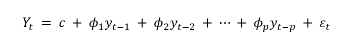
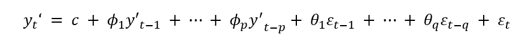

# Time-Series-Forecasting-NTPC-Stock-Data-
## Contents
### Overview :
This project investigates the application of various time series and machine learning forecasting models to a real-world stock closing price dataset. We begin by exploring the characteristics of stock prices and conducting a comprehensive analysis of the dataset. Subsequently, we focus on predicting the daily closing price of the S&P500 index using a range of forecasting models. These models will undergo rigorous evaluation, comparison, and analysis aligned with the project guidelines. Ultimately, the project aims to build a model capable of forecasting the S&P500 closing price for the next 30 days.
### Objective :
Predicting stock market behaviour has long been a subject of interest, with many believing it to be a complex, unpredictable process. The random walk theory, emphasizing the independence of past and future price movements, supports this view. However, recent advancements in data science and modelling techniques encourage a re-examination of this perspective.
 
This research aims to explore the potential of various forecasting models in predicting stock prices, specifically the S&P500 closing price. By comparing and contrasting these models, we seek to demonstrate their utility as tools for analysing stock price movements rather than infallible prediction instruments. Ultimately, this study aims to contribute to the understanding of stock price dynamics and the application of data-driven forecasting methods in financial analysis.
 

### Time Series:
A time series is a sequence of data points collected, recorded, or measured at successive, evenly-spaced time intervals. Each data point represents observations or measurements taken over time, such as stock prices, temperature readings, or sales figures. Time series data is commonly represented graphically with time on the horizontal axis and the variable of interest on the vertical axis, allowing analysts to identify trends, patterns, and changes over time. Time series data is often represented graphically as a line plot, with time depicted on the horizontal x-axis and the variable’s values displayed on the vertical y-axis. This graphical representation facilitates the visualization of trends, patterns, and fluctuations in the variable over time, aiding in the analysis and interpretation of the data. 
 

### Time Series Forecasting:
A forecasting algorithm is a computational process that predicts future values based on historical data. It involves collecting, processing, and analysing past data points to create a model that can estimate future outcomes for a specific variable. Time series forecasting is the process of analysing time series data using statistics and modelling to make predictions and inform strategic decision-making. It’s not always an exact prediction, and likelihood of forecasts can vary wildly—especially when dealing with the commonly fluctuating variables in time series data as well as factors outside our control. However, forecasting insight about which outcomes are more likely—or less likely— to occur than other potential outcomes. Often, the more comprehensive the data we have, the more accurate the forecasts can be. While forecasting and “prediction” generally mean the same thing, there is a notable distinction. In some industries, forecasting might refer to data at a specific future point in time, while prediction refers to future data in general. Series forecasting is often used in conjunction with time series analysis.
 
Time series analysis involves developing models to gain an understanding of the data to understand the underlying causes. Analysis can provide the “why” behind the outcomes you are seeing. Forecasting then takes the next step of what to do with that knowledge and the predictable extrapolations of what might happen in the future. 

### Stationarity:
A stationary time series is one whose statistical properties (mean, variance, autocorrelation) remain constant over time. In simpler terms, the data doesn't exhibit trends, seasonality, or other patterns that change systematically over time.
 
Thus, time series with trends, or with seasonality, are not stationary — the trend and seasonality will affect the value of the time series at different times. On the other hand, a white noise series is stationary — it does not matter when you observe it, it should look much the same at any point in time.

#### Key characteristics of a stationary time series:
**Constant mean:** The average value of the series is constant over time.  
**Constant variance:** The variability of the series around the mean is constant over time.  
**Constant autocorrelation:** The relationship between observations at different time points remains constant over time.
 

#### Why is stationarity important?
Most statistical time series models assume stationarity as a fundamental condition. Non-stationary data often needs to be transformed into stationary data before applying time series models. A stationary time series will have no predictable patterns in the long-term. Time plots will show the series to be roughly horizontal (although some cyclic behavior is possible), with constant variance.
 

#### Common methods to achieve stationarity:
**1.	Differencing:** Subtracting the previous value from the current value to remove trends.  
**2.	Log transformation:** Can stabilize variance in some cases.  
**3.	Other transformations:** E.g., square root, power transformations.  

#### Methods to Check Stationarity:
##### 1.	Visual Inspection
**Time Series Plot:** Look for trends, seasonality, or other patterns. A stationary series should fluctuate around a constant mean without clear trends.  
**ACF (Autocorrelation Function) and PACF (Partial Autocorrelation Function) Plots:** These plots measure the correlation of a time series with its past values. For a stationary series, the ACF and PACF should decay rapidly to zero.
 

##### 2.	Statistical Tests:
**Augmented Dickey-Fuller (ADF) Test:**
Tests for the presence of a unit root, indicating non-stationarity. A low p-value suggests stationarity.  
**Kwiatkowski-Phillips-Schmidt-Shin (KPSS) Test:**
Tests for stationarity around a mean or trend. A high p-value suggests stationarity.
 

#### Autoregressive models:
In a multiple regression model, we forecast the variable of interest using a linear combination of predictors. In an auto regression model, we forecast the variable of interest using a linear combination of past values of the variable. The model assumes that the current value is a linear combination of past values plus a random error term. The term auto regression indicates that it is a regression of the variable against itself.
 
Thus, an autoregressive model of order p can be written as:
 

where ε_t is white noise. This is like a multiple regression but with lagged values of y_t as predictors. We refer to this as an AR(p) model, an autoregressive model of order p.
Autoregressive models are remarkably flexible at handling a wide range of different time series patterns. Changing the parameters ϕ_1  ,…,ϕ_p results in different time series patterns. The variance of the error term εt will only change the scale of the series, not the patterns.
 

#### Moving Average Models: 
Rather than using past values of the forecast variable in a regression, a moving average model uses past forecast errors in a regression-like model.
 

where εt is white noise. We refer to this as an MA(q) model, a moving average model of order q. Of course, we do not observe the values of εt, so it is not really a regression in the usual sense. The model assumes that the current value is a linear combination of past error terms plus a random error term.
 

#### Arima : Autoregressive Integrating Moving Average
ARIMA is a statistical model used for time series data. It stands for Auto Regressive Integrated Moving Average. This method is often referred to as the Box-Jenkins approach. Box and Jenkins introduced the idea of using differencing to convert data that doesn't have a constant mean or variance (non-stationary) into data that does (stationary).  
The full model can be written as,
 
Where, Yt= y_t‘, is the differenced time series value, ϕ and θ are unknown parameters and e are independent identically distributed error terms with zero mean. Here, Yt is expressed in terms of its past values and the current and past values of error terms.

 
The ARIMA model combines three key elements:

**Auto Regression (AR):** In auto-regression the values of a given time series data are regressed on their own lagged values, which is indicated by the “p” value in the model.
**Differencing (I for Integrated):** To handle data with trends or seasonality, differencing is applied. This involves subtracting previous values from current values to stabilize the data. The 'd' parameter specifies the order of differencing. If d = 1, it looks at the difference between two time-series entries, if d = 2 it looks at the differences of the differences obtained at d =1, and so forth.
**Moving Average (MA):** This component incorporates past error terms into the prediction. The 'q' parameter determines the number of error terms included.
 
Together, these components form the ARIMA(p, d, q) model, where p, d, and q represent the order of autoregression, differencing, and moving average, respectively.
 

##### Steps to build ARIMA model.  
**Step 1: Testing for Stationarity**
Stationarity is a crucial property in time series analysis. A stationary time series exhibits constant statistical properties over time, including mean, variance, and autocorrelation. This characteristic is essential for applying many time series models, such as ARIMA.
 
The Augmented Dickey-Fuller (ADF) test is commonly used to determine if a time series is stationary. The null hypothesis of the ADF test is that the time series is non-stationary. If the p-value of the test is less than a chosen significance level (usually 0.05), we reject the null hypothesis and conclude that the series is stationary.
 

**Differencing–** To convert a non-stationary process to a stationary process, we apply the differencing method. Differencing is a technique used to transform a non-stationary time series into a stationary one. It involves calculating the difference between consecutive data points. This process can be applied multiple times to achieve stationarity.  
_First difference:_ The difference between the current value and the previous value.  
_Second difference:_ The difference between two consecutive first differences. The appropriate order of differencing (d in ARIMA) is determined through experimentation and analysis of the differenced series.
 
Once the series is stationary, we can proceed to the next step of identifying the AR and MA components.

**Step 2: Identification of p and q**
This step involves determining the appropriate values for the autoregressive (AR) order (p) and moving average (MA) order (q) components of the ARIMA model. This is achieved by analysing the Autocorrelation Function (ACF) and Partial Autocorrelation Function (PACF) plots.  
_Identifying p (AR order):_ The ACF for AR models typically shows an exponential decay pattern. The PACF is used to identify the AR order. Significant spikes at specific lags indicate the potential AR order. For instance, one significant spike at lag 1 suggests an AR(1) model, while multiple significant spikes at lags 1, 2, and 3 indicate an AR(3) model.  
_Identifying q (MA order):_ The PACF for MA models typically shows an exponential decay pattern. The ACF is used to identify the MA order. Significant spikes at specific lags indicate the potential MA order. For example, one significant spike at lag 1 in the ACF suggests an MA(1) model.
 

**Step 3: Estimation and Forecasting**
Once the optimal values for p, d, and q have been determined, the next step involves building and evaluating the ARIMA model.
 
The ARIMA model is fitted to the time series data to estimate the coefficients associated with the AR and MA terms. The model's performance is assessed using metrics like Mean Squared Error (MSE), Root Mean Squared Error (RMSE), Mean Absolute Error (MAE), and Mean Absolute Percentage Error (MAPE) on a training or validation dataset.
 

#### Moving Average Convergence Divergence (MACD):
MACD is a technical indicator used to identify trends and potential buy or sell opportunities. It measures the relationship between two moving averages of a security's price. Specifically, it is calculated by subtracting the 26-period Exponential Moving Average (EMA) from the 12-period EMA.  
##### Formula:
                MACD = 12-Period EMA − 26-Period EMA
 

##### Exponential Moving Average: 
An exponential moving average (EMA) is a type of moving average (MA) that places a greater weight and significance on the most recent data points. The exponential moving average is also referred to as the exponentially weighted moving average. An exponentially weighted moving average reacts more significantly to recent price changes than a simple moving average (SMA), which applies an equal weight to all observations in the period.  
**MACD Line:** The result of subtracting the 26-period EMA from the 12-period EMA is called the MACD line.  
**Signal Line:** To generate trading signals, a nine-period EMA of the MACD line is calculated, known as the signal line.
 

##### Trading Signals:  
**Bullish Signal:** When the MACD line crosses above the signal line, it's often considered a bullish signal, indicating a potential upward trend.  
**Bearish Signal:** When the MACD line crosses below the signal line, it's often seen as a bearish signal, suggesting a potential downward trend.
 

##### Significance of MACD: 
MACD is a versatile tool for technical traders, providing valuable insights into market trends and momentum. MACD helps identify the overall direction of a trend (upward or downward) by observing the relationship between the MACD line and the signal line.
**Momentum Confirmation:** The speed at which the MACD line crosses the signal line indicates the strength of the underlying momentum.  
**Divergence Detection:** MACD can identify potential trend reversals by comparing its movement to the price action. When the two diverge, it might signal a weakening trend.  
**Overbought/Oversold Conditions:** While not a primary function, MACD can provide some clues about overbought or oversold conditions based on its extreme values.
 

##### Learning from MACD :
**Positive MACD:** Indicates the 12-period EMA is above the 26-period EMA, suggesting a potential uptrend.  
**Negative MACD:** Indicates the 12-period EMA is below the 26-period EMA, suggesting a potential downtrend.  
**MACD Histogram:** Represents the difference between the MACD line and its signal line.  
_A positive histogram suggests bullish momentum._  
_A negative histogram suggests bearish momentum._ 
 
The magnitude of the MACD value and the histogram's height can provide additional clues about the strength of the trend or the potential for a reversal.

##### Limitations :
Divergence signals often precede a potential reversal, but not always. Many divergences result in continued price movement in the same direction, leading to false signals. MACD divergence doesn't capture all market reversals. Some significant reversals occur without a clear divergence signal. In other words, it predicts too many reversals that don’t occur and not enough real price reversals.
 

#### NTPC Stock Price Data (2022-2024)
To investigate the stock price behaviour of NTPC, daily stock price data was obtained from [Yahoo Finance](https://finance.yahoo.com) using the quantmod package in R. The dataset spanned from January 1, 2024, to June 01, 2024. Rows containing missing values were removed using the na.omit function to ensure data integrity for subsequent analysis. The index of the NTPC.NS data frame, representing dates, was converted into a proper date format using the lubridate package. This allows for date-based analysis and visualizations. The head function was used to display the first few rows of the NTPC.NS data frame, providing a glimpse into the structure and content of the data. Also, Two types of charts were created to visualize the downloaded data; line Chart and Technical Analysis Indicators. To ensure the applicability of ARIMA models, the stationarity of the time series was assessed using the ADF and KPSS tests. These tests help determine if the data has a constant mean, variance, and autocorrelation over time.
 

**Model Building:** An auto-ARIMA model was fitted to the data using the    _auto.arima_ function from the forecast package. This function automatically determines the optimal values for the parameters (p, d, q) of the ARIMA model.  
**Model Diagnostics:** The residuals from the fitted ARIMA model were subjected to diagnostic tests to assess the model's adequacy. These tests included- KPSS test, ADF test, ACF and PACF plots, Ljung-Box test and Histogram of residuals.  
**Model Evaluation:** The fitted ARIMA model was evaluated using standard error metrics such as Mean Squared Error (MSE), Mean Absolute Error (MAE), and Root Mean Squared Error (RMSE) to assess its predictive accuracy.  
**Forecasting:** To forecast future stock prices, an ARIMA model was constructed using the _auto.arima_ function. The model was then used to generate predictions for the next 30 days. To align the forecasted values with their corresponding dates, a sequence of future dates was generated starting from the last date in the original dataset. The forecasted values and their corresponding dates were combined into a data frame for subsequent visualization. The forecasted values along with their corresponding dates were plotted using the ggplot2 package to visualize the predicted stock prices.  
**Data Splitting and Model Training:** To assess the predictive performance of the ARIMA model, the dataset was divided into training and testing sets. 80% of the data was allocated for model training, while the remaining 20% was reserved for evaluation. An auto-ARIMA model was fitted to the training dataset using the auto.arima function, allowing the model to automatically determine the optimal ARIMA parameters. The trained ARIMA model was used to generate forecasts for the length of the test dataset. To assess the model's predictive accuracy, the forecasted values were compared against the actual values from the test set. The mean predicted values were plotted against the actual values to visualize the model's performance.
 
This approach provides a preliminary evaluation of the model's ability to capture the underlying patterns in the stock price data and generate accurate forecasts.

#### Code Snippet: 
Here’s the Detailed code:
[View the code](NTPC.R)

